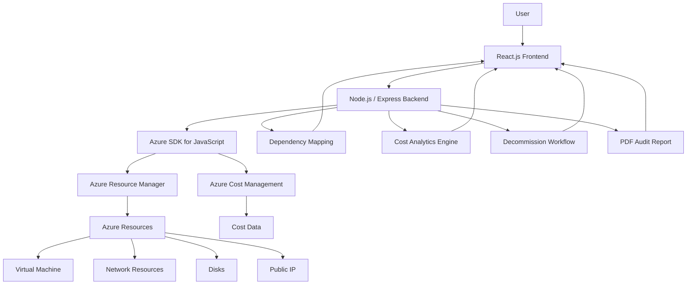

# Architecture Diagram

## Azure Resource Decommission Dashboard

## Architecture Explanation

1. **User** interacts with the Azure Resource Decommission Dashboard.
2. **React.js Frontend** provides the dashboard interface for resource inventory, dependency visualization, cost analysis, and decommission status.
3. **Node.js / Express Backend** handles application requests and communicates with Azure services.
4. **Azure SDK for JavaScript** connects the backend with Microsoft Azure.
5. **Azure Resource Manager** provides information about Azure resources and their current status.
6. **Azure Cost Management** provides cost information used for cost analysis and savings estimation.
7. **Dependency Mapping** identifies relationships between resources and helps detect possible orphaned or dependent resources.
8. **Cost Analytics Engine** analyzes resource costs and potential recovery.
9. **Decommission Workflow** categorizes resources based on their decommission status and audit requirements.
10. **PDF Audit Report** generates documentation of flagged resources, costs, and decommissioning information.

The architecture supports live synchronization with Azure and provides a unified workflow for safely analyzing and planning resource decommissioning.
